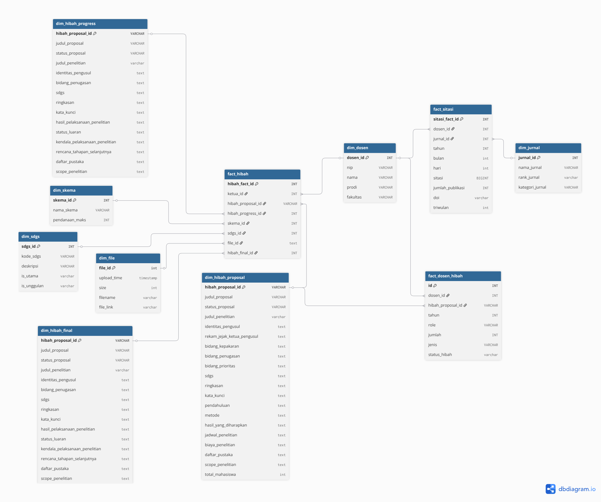

<p align="center">
  
</p>

<h1 align="center">LPPM ITERA Data Lakehouse</h1>

<p align="center">
  Research paper data lakehouse built on <b>Apache Iceberg</b>, <b>MinIO</b>, <b>Spark</b>, <b>Superset</b>, and <b>Airflow</b>.
</p>

---

## Stack

| Service | URL | Credentials |
|---------|-----|-------------|
| Jupyter (Spark) | http://localhost:8888 | - |
| Spark UI | http://localhost:8080 | - |
| Spark Thrift Server | http://localhost:10000 | - |
| Trino | http://localhost:8085 | `trino` |
| Iceberg REST | http://localhost:8181 | - |
| MinIO Console | http://localhost:9001 | `admin` / `password` |
| Superset | http://localhost:8088 | `admin` / `admin` |
| Airflow | http://localhost:8082 | `airflow` / `airflow` |

## Query Engine Connections (Superset SQLAlchemy URI)

| Engine | SQLAlchemy URI | Use case |
|--------|----------------|----------|
| Spark SQL (Thrift) | `hive://lppm-spark-iceberg:10000/silver` | WAP testing, Iceberg branches |
| Trino | `trino://trino@lppm-trino:8085/default` | Dashboard queries (read-only) |

## Prerequisites

- Docker Engine
- Minimum 8 GB RAM

## How to Run

```bash
./start.sh
```

## Data Layers

| Layer | Purpose |
|-------|---------|
| **Bronze** | Raw data from source |
| **Audit** | Awaiting validation |
| **Silver** | Cleaned & validated |
| **Gold** | Dimension & fact tables for analytics |

## Schema

<p align="center">
  
</p>

## Common Commands

```bash
# Open PySpark shell
docker compose exec spark-iceberg pyspark

# List Airflow DAGs
docker compose --profile debug run --rm airflow-cli airflow dags list

# Tear down (preserve data)
docker compose down

# Tear down (wipe data)
docker compose down -v
```

## Project Layout

```
.
├── airflow/        # DAGs, plugins, config
├── minio/          # Bucket bootstrap script
├── notebooks/      # Jupyter notebooks
├── pipeline/       # Reusable Python pipeline
├── spark/          # Spark + Iceberg image
├── superset/       # Superset image & config
├── warehouse/      # Local Iceberg warehouse
└── docker-compose.yaml
```


# Fokus hari ini
1. ekstrak dokumen
2. buat tabel fakta
3. bikin dashboard

Total pendanaan : 128.909.280.121 (~129M)


yang sudah ada dimension and fact

1. dim sdgs (done, manual)
2. dim skema (done, manual)
3. dim dosen (done)
4. fact dosen hibah (done)
5. dim jurnal (done)
6. fact sitasi
7. fact hibah
8. dim_hibah_proposal
9. dim_hibah_progress
10. dim_hibah_final
